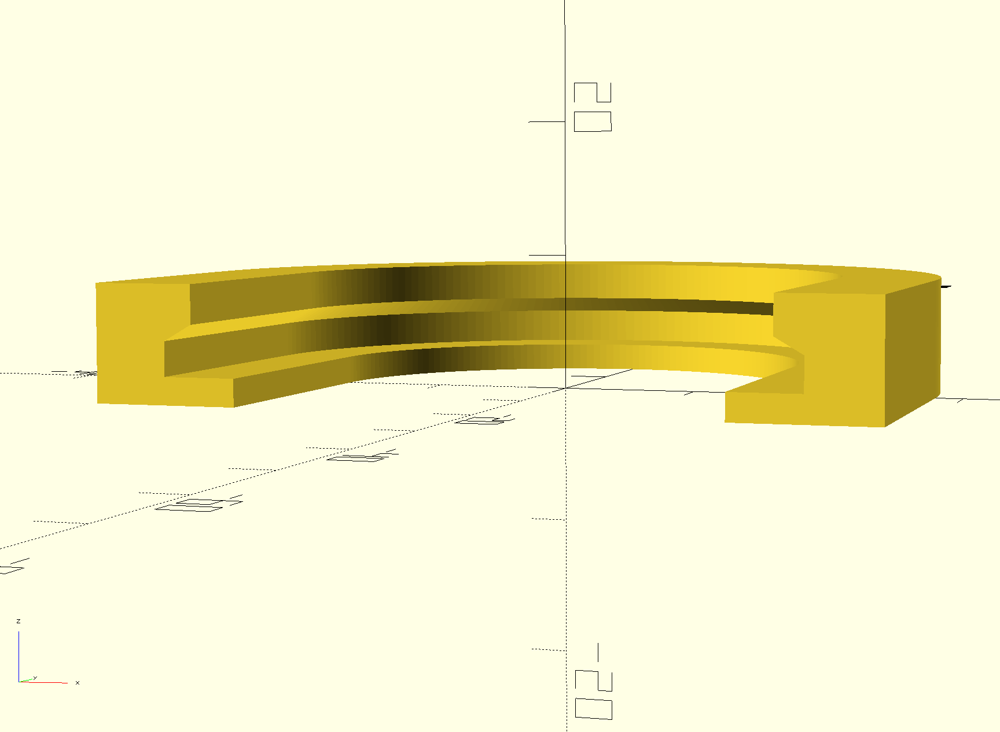
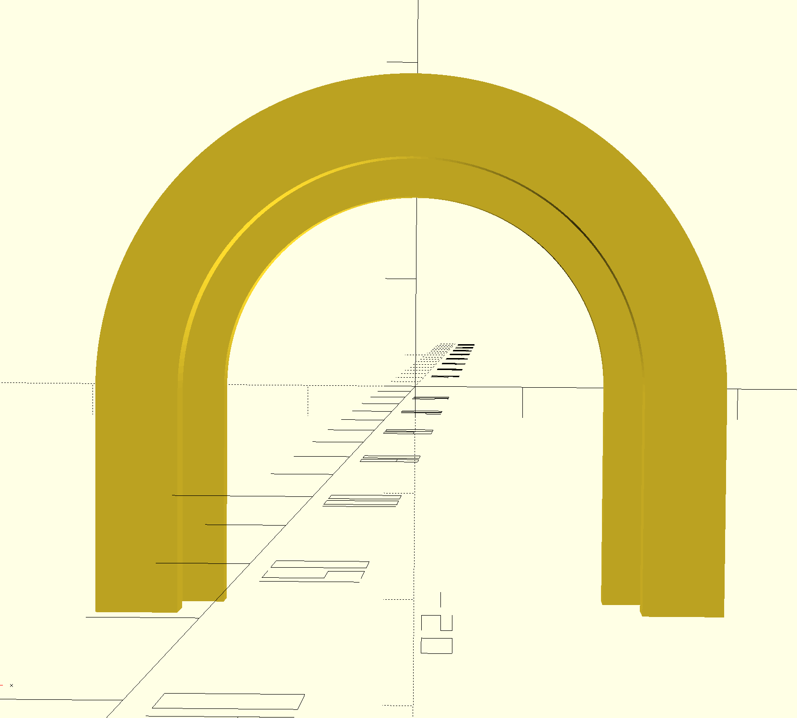

# Round Hygrometer Holder

U-shaped holder for the standard round mini hygrometer commonly sold on Amazon and similar sites. Designed to attach to the outside of a transparent 3D filament storage container with double-sided tape. Hygrometer slides in from the open end and is retained by its front lip.

**Example compatible hygrometer:** [Amazon B098JFRNKM](https://www.amazon.com/dp/B098JFRNKM?ref_=ppx_hzsearch_conn_dt_b_fed_asin_title_1)

## Target Device Dimensions

| Dimension | Value |
|-----------|-------|
| Front lip outer diameter | 45 mm |
| Body outer diameter | 40 mm |
| Total depth | 15 mm |

## Renders

## Design

- U-shaped profile printed flat on the build plate (U lies on its side)
- 180° arc + two straight tangent arms form the U
- Inner stepped channel captures the hygrometer lip; body slides through freely
- Chamfered inner step (default 30°) minimizes overhang for support-free printing
- Fully parametric OpenSCAD source in `src/hygrometer-holder.scad`

### Key Parameters

| Parameter | Default | Description |
|-----------|---------|-------------|
| `inner_bottom_r` | 17.5 mm | Front-stop radius (35 mm inner gap) |
| `lip_r` | 22.75 mm | Lip channel radius (45.5 mm gap) |
| `body_r` | 20.715 mm | Body channel radius (41.43 mm gap) |
| `outer_r` | 28 mm | Outer wall radius |
| `z_floor` | 2 mm | Front-stop ledge height |
| `z_lip_top` | 4.5 mm | Top of lip channel |
| `z_top` | 8.5 mm | Total holder height |
| `arm_length` | 20 mm | Straight arm extension length |
| `overhang_angle` | 30° | Chamfer angle on inner step |

## Print Settings

- **Supports:** None required (chamfered inner step)
- **Orientation:** Flat on bed as designed
- **Material:** PLA or PETG recommended
- **Infill:** 20–30%

## Repository Layout

- `src/` — OpenSCAD parametric source
- `publication/` — Platform-specific export folders (MakerWorld, Printables, etc.)
